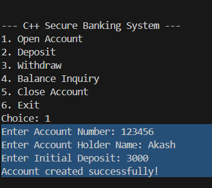
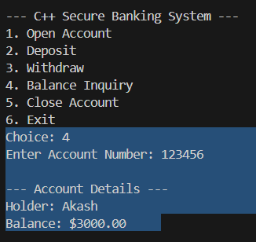
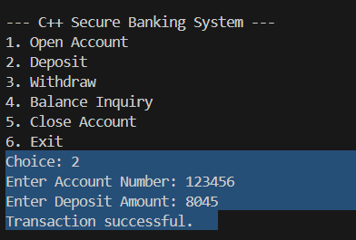
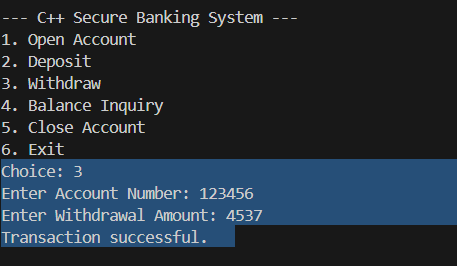
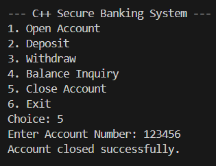

# 🏦 Secure Banking Simulation (C++)

A CLI-based banking application simulating real-world financial transactions and account management.

### 🚀 Key Features
- **Account Management**: Support for opening and closing (deleting) accounts.
- **Transactions**: Secure deposit and withdrawal logic with balance checks.
- **Audit Trail**: Every transaction is timestamped and logged in a separate `transactions.txt` file.
- **Encapsulation**: Private data members ensure account balances cannot be modified externally.

### 🛠️ Technical Skills
- **Constructors & Destructors**: Managed object lifecycle and safe data flushing.
- **Transaction Logging**: Used `<ctime>` to implement real-time activity tracking.
- **File Manipulation**: Used `std::ios::trunc` for safe data overwriting.

[Video Demo Name](./Bank.cpp - z - Visual Studio Code 2026-05-03 23-52-32.mp4)
