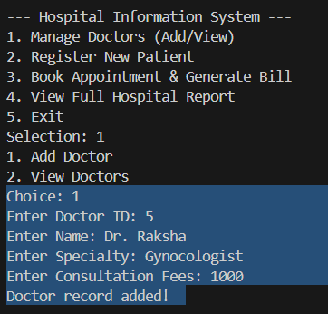
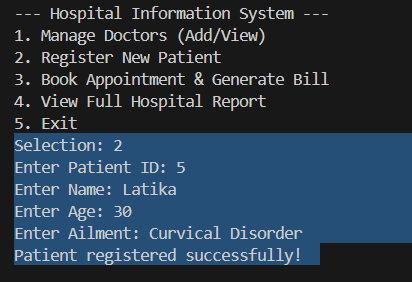
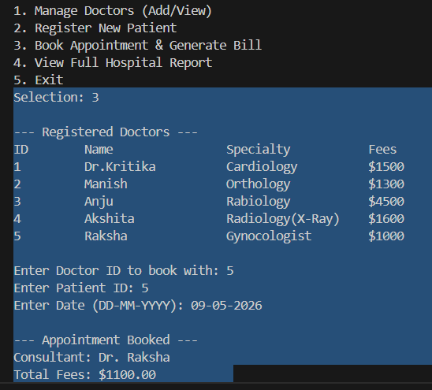
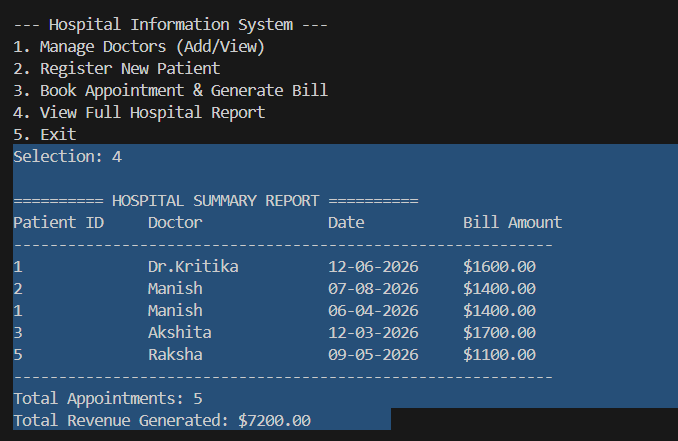

# 🏥 Hospital Information System (C++)

A multi-entity management system that links Patients, Doctors, and Appointments.

### 🚀 Key Features
- **Dynamic Doctor Registry**: Manage medical staff records via persistent storage.
- **Appointment Booking**: Links patients to doctors and calculates automated billing.
- **Revenue Reporting**: Generates a comprehensive hospital report including total revenue and patient counts.
- **Multi-Class Interaction**: Demonstrates how different objects (Patient/Doctor) interact within a manager class.

### 🛠️ Technical Skills
- **Inheritance**: Used a base `Person` class for Patients and Doctors to reduce code redundancy.
- **Complex File I/O**: Parsing multiple interconnected text files.
- **Business Logic**: Automated billing including consultation fees and service taxes.

