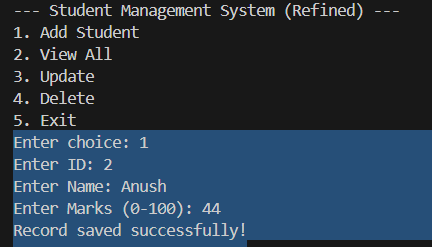
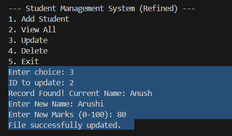
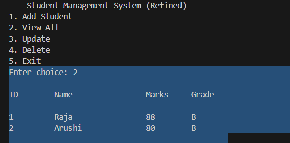
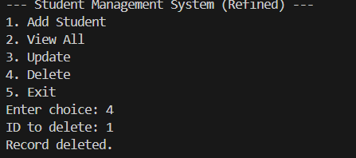
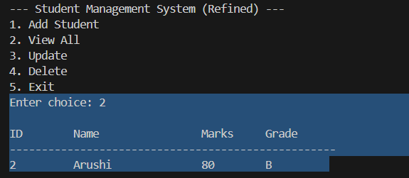

# 🎓 Student Management System (C++)

A robust Command Line Interface (CLI) application designed to handle student records using Object-Oriented Programming (OOP).

### 🚀 Key Features
- **Full CRUD Operations**: Create, Read, Update, and Delete student records.
- **Data Persistence**: Stores information in `students.txt` using file streams (`fstream`).
- **Input Validation**: Prevents duplicate IDs and validates marks (0-100).
- **Formatted Reports**: Generates a clean tabular view of student performance and grades.

### 🛠️ Technical Skills
- **C++ STL**: Used `std::vector` for memory management and `std::numeric_limits` for buffer clearing.
- **Defensive Programming**: Implemented checks for file availability and ID collisions.
- **Data Encapsulation**: Used classes to separate data logic from file I/O logic.

